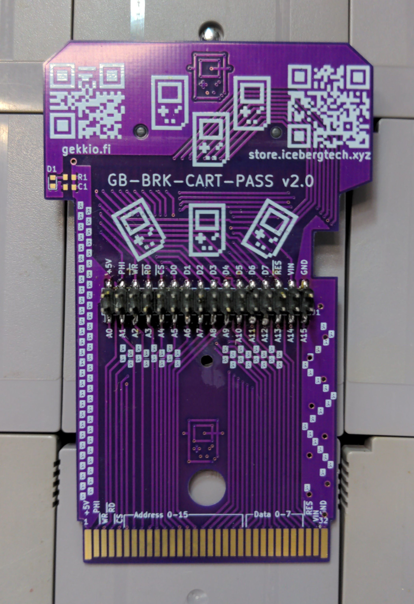
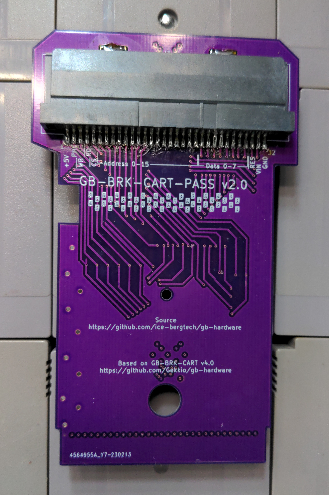
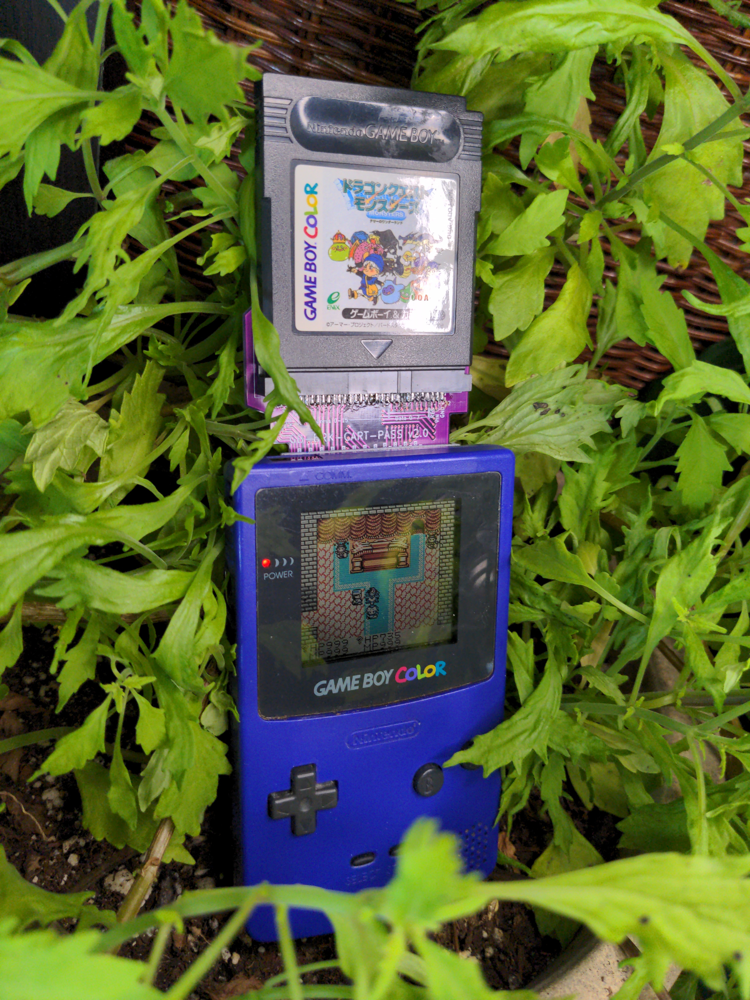

# GB-BRK-CART-PASS

The GB-BRK-CART-PASS is a breakout cartridge made for use in all Gameboys.
It is a special cartridge designed to enable monitoring and testing of specific pins on a Gameboy and cartridge during normal operation.
It allows for a few different modes of operation:

Interact with Gameboy console directly from cartridge pins
Interact with Gameboy cartridge, without needing a console
Snoop on communication between a game cartridge and the console

WARNING: this can and probably will screw with the game being played, with the potential for save game data loss or odd behavior.

---

Version 1.0 is compatible with all Gameboy models EXCEPT for the DMG, because of the power switch.

Version 2.0 has the cutout for the power switch, and is compatible with all Gameboy models.

---

Store Page: https://www.etsy.com/listing/1413849592/gameboy-breakout-passthrough-cartridge

PCB Source code: https://github.com/ice-bergtech/gb-hardware/tree/master/GB-BRK-CART-PASS

Case Models: https://github.com/ice-bergtech/gb-hardware/tree/master/GB-BRK-CART-PASS/case

Based on the GB-BRK-CART design from Gekkio.
Check it out here: https://github.com/Gekkio/gb-hardware/tree/master/GB-BRK-CART

Case is modified from one designed by Chelsea486MHz.
Check it out here: https://github.com/Chelsea486MHz/gbcase 

